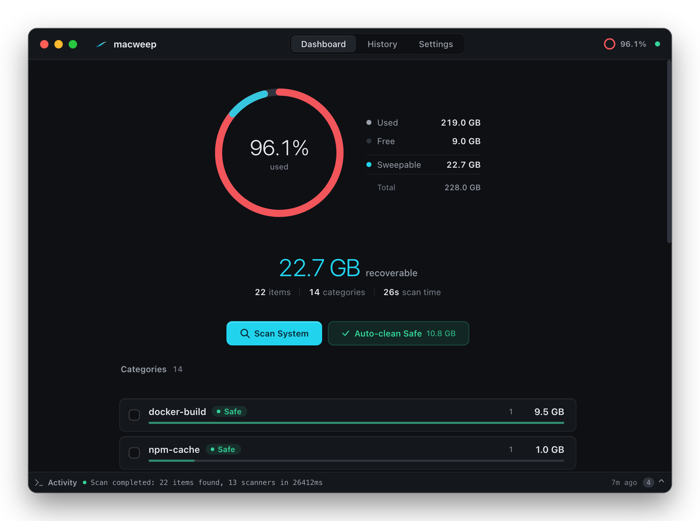
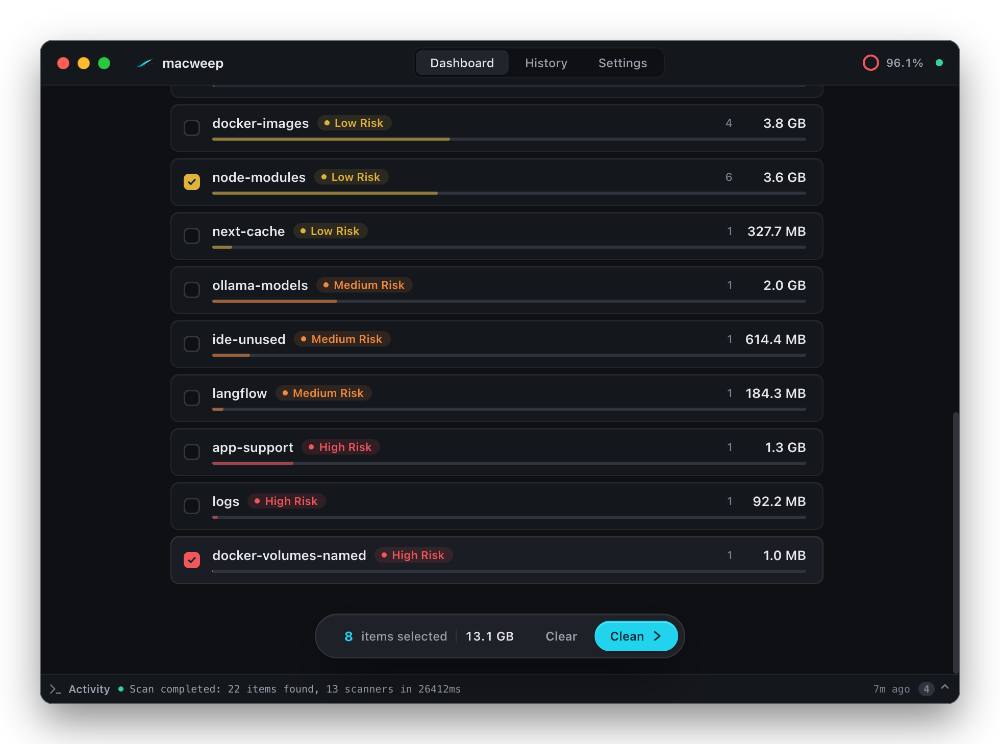
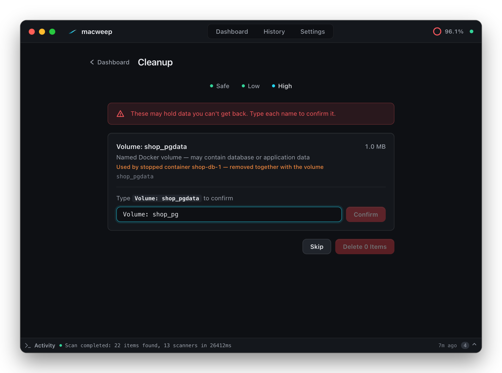
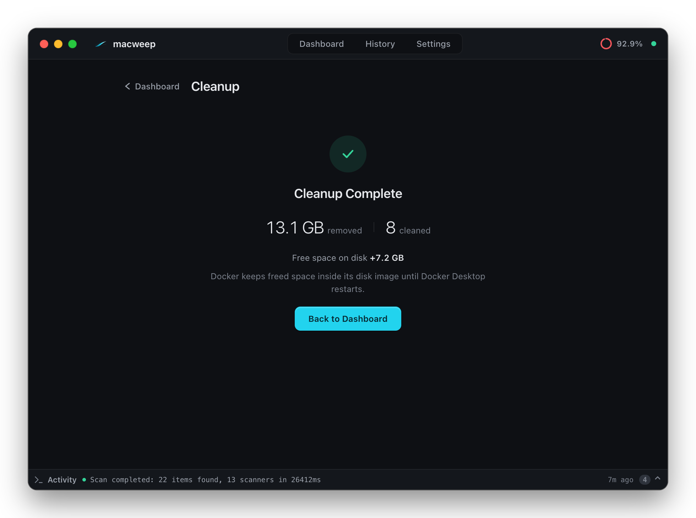

<div align="center">


# macweep

Recupere o espaço em disco que suas ferramentas de dev comem em silêncio,<br />sem arriscar nada que importa.

[Baixar para Mac](https://github.com/vinimlo/macweep/releases/latest) &nbsp;·&nbsp; [Compilar do código](#compilar-do-código) &nbsp;·&nbsp; [Read in English](README.md)

[](https://github.com/vinimlo/macweep/releases/latest)
[](#instalação)
[](#instalação)
[](LICENSE)

<br />



</div>

## Por quê

De tempos em tempos meu MacBook de 256 GB ficava sem espaço, e toda vez eu repetia o mesmo ritual:

```bash
docker system prune -a
npm cache clean --force
brew cleanup --prune=all
rm -rf ~/code/*/node_modules
# ...e o que mais eu conseguisse lembrar
```

Eu nunca lembrava de tudo, nunca sabia quanto cada comando devolvia, e todo `rm -rf` vinha com um friozinho na barriga. O macweep transforma esse ritual num scan só. Ele encontra o que as suas ferramentas conseguem recriar sozinhas, mostra o risco de apagar cada coisa e pede mais cuidado quanto mais há a perder.

A interface do app está em inglês, então os nomes de botões e níveis abaixo aparecem como no app.

## O que ele encontra

Treze scanners vasculham os suspeitos de sempre e separam tudo em quatro níveis. O nível define como você confirma.

| Nível | O que cai aqui | Como você confirma |
|---|---|---|
| Safe | caches do npm, Yarn e Bun; caches do pip e do Homebrew; cache de build do Docker; cache do TypeScript; downloads de atualização do Cursor | Um clique para o grupo inteiro |
| Low | `node_modules` e `.next/cache` dos seus projetos; imagens Docker; volumes Docker órfãos | Uma lista item a item, toda marcada, em que você desmarca o que quer manter |
| Medium | modelos do Ollama; dados do Langflow, Gemini CLI, CodeRabbit e OpenCode; configurações que sobraram do Cursor, Trae e Antigravity | Nada vem marcado, e cada item diz se a ferramenta ainda está instalada |
| High | volumes Docker nomeados; as maiores pastas de `~/Library/Application Support`; `~/Library/Logs` | Você digita o nome de cada item |

Os projetos são encontrados percorrendo a sua pasta pessoal até seis níveis de profundidade. `Library`, `Documents`, `Desktop`, `Downloads`, pastas de mídia e diretórios de toolchain como `~/.cargo` ficam de fora, então um projeto guardado dentro de `~/Documents` não aparece.

<p align="center">
  
</p>

## Feito para não quebrar nada

O macweep apaga de verdade. Nada vai para a Lixeira, então as proteções ficam no backend em Rust, não só na interface.

Alguns caminhos nunca são oferecidos nem apagados: `~/Documents`, `~/Desktop`, `~/Downloads`, `~/Pictures`, `~/Photos`, `~/.ssh`, `~/.gnupg`, `~/Library/Keychains`, os backups do seu iPhone, `~/.gitconfig`, `~/.zshrc` e `~/.bashrc`. Logo antes de remover qualquer coisa, o caminho é conferido de novo, e symlinks ou caminhos que apontam para fora da pasta de origem são recusados.

Imagens e volumes Docker ficam intocados enquanto houver algum container rodando, ou se o Docker não responder. Um volume nomeado que ainda pertence a um container parado avisa isso, e o container vai embora junto com ele. Um `node_modules` cujo projeto tem mudanças no Git ainda não commitadas ganha um aviso.

A interface nunca manda um caminho para o backend. Ela manda os IDs dos itens que o último scan encontrou, e cada um só pode ser limpo uma vez. Os comandos rodam como programa mais argumentos, nunca através de um shell. Não há telemetria nem conta, e o app não faz nenhuma requisição de rede.

<p align="center">
  
</p>

## Números em que dá para confiar

Cada pasta é medida logo antes e logo depois de ser removida, então o relatório mostra o que de fato saiu do disco. Logo abaixo aparece quanto espaço livre o disco realmente ganhou.

Esses dois números podem ser diferentes, e o relatório explica o motivo quando isso acontece. O Docker Desktop guarda o espaço liberado dentro da imagem de disco dele até ser reiniciado, e o macOS pode segurar arquivos apagados em snapshots locais por um tempo antes de o espaço aparecer como livre.

Se um item falha, ele aparece na lista com o motivo e continua disponível para uma nova tentativa. Toda ação fica registrada em `~/.storage-cleanup/audit.jsonl`, que você consulta na aba History.

<p align="center">
  
</p>

## Instalação

Baixe o `.dmg` mais recente em [Releases](https://github.com/vinimlo/macweep/releases/latest) e arraste o macweep para Aplicativos. Ele roda em Macs com Apple Silicon e macOS 14 ou mais recente.

O app ainda não é notarizado, então o Gatekeeper bloqueia a primeira abertura. Abra Ajustes do Sistema › Privacidade e Segurança, role até o fim e clique em Abrir Mesmo Assim ao lado da mensagem do macweep. Só é preciso fazer isso uma vez.

O macweep também fica na barra de menus. Full Scan abre o dashboard e começa o scan, e Auto-clean Safe leva direto para a confirmação do grupo Safe, fazendo o scan antes se precisar.

Para desinstalar, arraste o macweep de Aplicativos para a Lixeira. Os logs dele ficam em `~/.storage-cleanup`, então apague essa pasta também se não quiser deixar rastro.

## Compilar do código

Você vai precisar do macOS 14 ou mais recente, das Xcode Command Line Tools, do [Rust](https://rustup.rs) stable, do Node.js 22 ou mais recente e do Docker para o frontend de desenvolvimento.

```bash
git clone https://github.com/vinimlo/macweep.git
cd macweep
npm ci
cargo install tauri-cli --version "^2" --locked   # só na primeira vez

make dev        # hot reload: frontend no Docker, app no seu Mac
make install    # build de release, copiado para /Applications
```

`make test` roda os testes em Rust e o svelte-check, e `make lint` roda o clippy e o svelte-check. Os testes de limpeza do Docker precisam de um daemon rodando, por isso são opcionais: `cd src-tauri && cargo test -- --ignored docker`. `make build-dmg` gera o instalador e pede `pip install -r requirements-dev.txt` antes.

## Por dentro

Um backend em Rust sobre o [Tauri v2](https://v2.tauri.app) e um frontend em SvelteKit com Svelte 5. Cada categoria é um tipo em Rust que implementa uma única trait `Scanner`, com `scan` e `clean`, então ensinar o macweep a reconhecer um novo tipo de lixo é adicionar um arquivo em `src-tauri/src/scanner/`. O progresso do scan chega à janela por canais do Tauri, e a limpeza roda via `tokio::process::Command` ou chamadas diretas ao sistema de arquivos.

## Contribuindo

Issues e pull requests são bem-vindos, principalmente scanners novos para ferramentas que acumulam espaço em disco. O [CONTRIBUTING.md](CONTRIBUTING.md) explica o setup e as regras de segurança que toda mudança precisa manter. Se encontrar um problema de segurança, siga o [SECURITY.md](SECURITY.md) em vez de abrir uma issue pública.

## Licença

[Apache 2.0](LICENSE)

<br />

<div align="center">
<sub>Feito com Tauri, Rust e a frustração de ficar sem espaço em disco.</sub>
</div>
