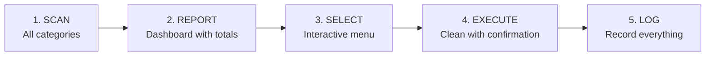

# macOS Storage Cleanup Tool

> Status: **📐 Designed**

## Problem Statement

MacBooks with limited SSDs (245 GB) accumulate tens of GB in regenerable artifacts -- Docker images/volumes/build cache, `node_modules`, IDE caches, AI models, logs -- causing low disk space warnings, unexpected app closures, and general performance degradation.

There is no centralized tool that scans the system, categorizes findings by risk level, and allows selective cleanup with appropriate confirmation flows. Manual cleanup requires remembering dozens of commands across different tools (Docker, npm, brew, pip, ollama, etc.) and carries the risk of accidentally removing non-regenerable data.

The goal is to create an interactive CLI (`cleanup.sh`) that automates scanning, categorization, and selective cleanup with safety-first design. It should be installable at `~/.cleanup/` and runnable on-demand or periodically.

## Current State

### The Manual Approach

Currently, cleanup is done ad-hoc via individual terminal commands:

```bash
# Each tool has its own cleanup command
npm cache clean --force
brew cleanup --prune=all
docker builder prune -a -f
docker image prune -a -f
docker volume prune -f
# Plus: finding and removing stale node_modules, IDE caches, AI model caches...
```

Problems with this approach:

- **No visibility** -- no unified view of what is consuming disk space across all tools
- **No risk assessment** -- no distinction between safe-to-remove caches and potentially important data
- **No logging** -- no record of what was cleaned and how much space was freed
- **Error-prone** -- easy to forget categories or accidentally remove important data
- **Repetitive** -- same commands typed manually every few weeks

### Known Space Consumers on This System

Based on real analysis of the current MacBook Air M4 (245 GB SSD):

| Category | Typical Size | Regenerable? |
|----------|-------------|--------------|
| Docker build cache | 5-10 GB | Yes (rebuild) |
| Docker images (idle) | 5-15 GB | Yes (pull/build) |
| Docker volumes (orphan) | 2-8 GB | Varies |
| `node_modules` across projects | 3-8 GB | Yes (`npm install`) |
| npm/yarn/bun/pip caches | 1-4 GB | Yes (auto-recreated) |
| Homebrew cache | 200-500 MB | Yes (`brew cleanup`) |
| IDE caches (Cursor, Trae, etc.) | 1-3 GB | Yes (IDE recreates) |
| Ollama models | 1-5 GB | Yes (`ollama pull`) |
| Stale tool data (Langflow, etc.) | 1-5 GB | N/A (tool uninstalled) |

**Estimated recoverable space: 20-60 GB** depending on system state.

## Research

### Risk Classification Model

The key design insight is classifying cleanup targets by risk level, which determines the confirmation UX:

| Risk Level | Description | Confirmation Flow | Examples |
|-----------|-------------|-------------------|----------|
| 🟢 Zero | 100% regenerable caches | Simple Y/n prompt | npm cache, brew cache, Docker build cache |
| 🟡 Low | Regenerable with a command (`npm install`, `docker pull`) | List items, then confirm | `node_modules`, idle Docker images, `.next/cache` |
| 🟠 Medium | Tools possibly no longer installed | Show install status + last use, then confirm | Langflow data, Ollama models, unused IDE configs |
| 🔴 High | May contain important state | Double confirmation (type name to confirm) | Named Docker volumes (db-data), Application Support |

### Scan Categories

#### 🟢 Risk Zero -- Always Safe

| ID | Target | Scan | Clean |
|----|--------|------|-------|
| `npm-cache` | npm cache | `du -sh ~/.npm` | `npm cache clean --force` |
| `yarn-cache` | Yarn cache | `du -sh ~/Library/Caches/yarn` | `yarn cache clean` |
| `bun-cache` | Bun cache | `du -sh ~/.bun/install/cache` | `bun pm cache rm` |
| `pip-cache` | pip cache | `du -sh ~/Library/Caches/pip` | `pip cache purge` |
| `brew-cache` | Homebrew cache | `du -sh $(brew --cache)` | `brew cleanup --prune=all` |
| `docker-build` | Docker build cache | `docker system df` (Build Cache row) | `docker builder prune -a -f` |
| `ts-cache` | TypeScript cache | `du -sh ~/Library/Caches/typescript` | `rm -rf ~/Library/Caches/typescript` |
| `cursor-updates` | Cursor update cache | `du -sh ~/Library/Caches/com.todesktop.230313mzl4w4u92.ShipIt` | `rm -rf ...` |

#### 🟡 Risk Low -- Regenerable with a Command

| ID | Target | Scan | Clean | Regeneration |
|----|--------|------|-------|-------------|
| `node-modules` | `node_modules` in projects | `find ~ -name "node_modules" -type d -prune` | `rm -rf <path>` per item | `npm install` |
| `docker-images` | Docker images without active containers | `docker images --format` | `docker image prune -a -f` | `docker pull` / `docker compose build` |
| `docker-volumes-orphan` | Dangling Docker volumes | `docker volume ls -f dangling=true` | `docker volume prune -f` | Rebuild |
| `next-cache` | `.next/cache` in Next.js projects | `find ~ -path "*/.next/cache" -type d` | `rm -rf <path>` | Next rebuild |

#### 🟠 Risk Medium -- Possibly Stale

| ID | Target | Detection Criteria |
|----|--------|-------------------|
| `langflow` | `~/.langflow` | Check `which langflow` |
| `ollama-models` | Ollama models | `ollama list` -- confirm per model |
| `ide-unused` | IDE configs (`.trae`, `.antigravity`, `.cursor`) | Check if app is still installed |
| `gemini-cache` | `~/.gemini` | Check `which gemini` |
| `coderabbit` | `~/.coderabbit` | Check recent usage |
| `opencode` | `~/.opencode`, `~/.config/opencode`, `~/.cache/opencode` | Check recent usage |

#### 🔴 Risk High -- May Contain State

| ID | Target | Alert |
|----|--------|-------|
| `docker-volumes-named` | Named Docker volumes (db-data, etc.) | May contain database data |
| `app-support` | `~/Library/Application Support` (top consumers) | Application state/data |
| `logs` | `~/Library/Logs/*` | May be needed for debugging |

### Safety Rules

**Protected paths** -- the tool must NEVER offer to clean:

- `~/Documents/`, `~/Desktop/`, `~/Downloads/`, `~/Pictures/`, `~/Photos/`
- `~/Library/Keychains/`, `~/Library/Application Support/MobileSync/`
- `~/.ssh/`, `~/.gnupg/`
- `~/.gitconfig`, `~/.zshrc`, `~/.bashrc`
- Any project directory with uncommitted Git changes (for `node_modules` cleanup, show a warning but allow it since `node_modules` itself is safe)

**Pre-flight checks:**

- Verify Docker containers are not running before removing their volumes/images
- Check disk free percentage -- skip cleanup offer if >30% free (unless `--force`)
- Detect available tools at startup (Docker, npm, brew, etc.) and only enable relevant categories

### Existing Tools Comparison

| Tool | Platform | Approach | Limitation |
|------|----------|----------|-----------|
| **ncdu** | Cross-platform | Interactive disk usage browser | No cleanup automation; no risk categorization |
| **OmniDiskSweeper** | macOS | GUI disk browser | No automation; discontinued |
| **docker system prune** | Docker only | Cleans Docker artifacts | Only Docker; no other categories |
| **npkill** | Node.js | Interactive `node_modules` finder | Only node_modules; no other categories |
| **CleanMyMac** | macOS | Commercial GUI | Paid; opaque about what it removes; not scriptable |

None of these provide a unified, risk-categorized, scriptable cleanup across all developer tool categories.

## Proposed Approach

### Architecture

```
~/.cleanup/
├── cleanup.sh              # Main entrypoint
├── lib/
│   ├── scanner.sh          # Scan functions per category
│   ├── cleaner.sh          # Clean functions per category
│   ├── ui.sh               # Colors, formatting, prompts
│   └── safety.sh           # Validations and confirmations
├── config.yaml             # Category configuration and thresholds
└── logs/
    └── cleanup-YYYY-MM-DD.log  # Execution log
```

### Execution Flow



### Interactive Dashboard

On launch, the tool displays a dashboard showing all categories with their size, risk level, and status. The user then chooses:

- **[A]** Auto-clean all 🟢 risk-zero items
- **[S]** Select categories manually
- **[D]** Detail a specific category (drill down to individual items)
- **[Q]** Quit

### Confirmation Flows by Risk Level

- **🟢 Zero**: Simple `[Y/n]` prompt
- **🟡 Low**: Show itemized list with sizes, then `[A]ll / [S]elect / [P]skip`
- **🟠 Medium**: Show install status and last-use date, ask `[y/N]`
- **🔴 High**: Double confirmation -- user must type the exact resource name to confirm

### Execution Modes

```bash
./cleanup.sh              # Interactive (default)
./cleanup.sh --scan       # Report only, no cleanup
./cleanup.sh --safe       # Auto-clean 🟢 items only
./cleanup.sh --only docker  # Specific category group
./cleanup.sh --dry-run    # Show what would be done
./cleanup.sh --scan --json  # Machine-readable output
```

### Logging

Every execution produces a timestamped log at `~/.cleanup/logs/cleanup-YYYY-MM-DD-HHMMSS.log`:

```
[2026-02-23 02:15:00] SCAN  | npm-cache: 2.1 GB
[2026-02-23 02:15:05] CLEAN | npm-cache: removed 2.1 GB (npm cache clean --force)
[2026-02-23 02:15:12] SKIP  | docker-volumes-named: skipped by user
[2026-02-23 02:15:15] TOTAL | Freed: 9.7 GB | Duration: 15s
```

### Technical Considerations

- **Bash version**: macOS ships bash 3.2; the script should either target bash 3.2 compatibility or check for brew-installed bash 4+
- **Tool detection**: Auto-detect available tools at startup (`command -v docker`, etc.) and disable irrelevant categories
- **Size calculation**: Use `du -sk` internally, convert to human-readable for display
- **`node_modules` context**: Include project name, last-modified date, and git status for each found `node_modules`

## Alternatives Considered

| Alternative | Description | Why Not (for now) |
|---|---|---|
| **Python CLI** | Use Python (click/typer) instead of bash | Adds a runtime dependency; bash is universally available on macOS; the operations are fundamentally shell commands |
| **TUI framework (gum/charm)** | Use Go-based TUI tools for richer UI | Adds binary dependencies; bash with ANSI codes is sufficient for the dashboard/menu pattern |
| **LaunchAgent (scheduled)** | Run automatically on a schedule via macOS LaunchAgent | Over-engineering for v1; on-demand execution is sufficient; can add scheduling later |
| **GUI (Electron/SwiftUI)** | Build a native macOS app | Massive scope increase; the target user (developer) is comfortable with CLI |
| **Existing tool (npkill + docker prune + manual)** | Use existing tools in combination | No unified view; no risk categorization; no logging; requires remembering multiple tools |

## Feasibility Assessment

| Dimension | Assessment |
|---|---|
| **Complexity** | Medium -- many categories to implement, but each is straightforward (scan command + clean command) |
| **Effort** | ~8-12 hours for full implementation with all categories, testing, and polish |
| **Dependencies** | None beyond bash and the tools being cleaned (Docker, npm, etc.) -- all optional |
| **Risk** | Low -- the tool only runs cleanup commands the user would run manually; confirmation flows prevent accidents |
| **Portability** | macOS-specific (paths like `~/Library/`); could be extended to Linux with platform detection |

## Impact

| Metric | Before | After |
|---|---|---|
| Time to clean up disk | 15-30 min (manual) | 2-5 min (interactive) |
| Risk of accidental deletion | Medium (manual commands) | Low (risk-categorized confirmations) |
| Visibility into disk usage | None (ad-hoc `du` commands) | Full dashboard per category |
| Cleanup audit trail | None | Complete timestamped logs |
| Disk space maintained below | No target (reactive) | 85% (proactive with `--safe` mode) |

Estimated space recovery per run: **10-40 GB** depending on system state and categories selected.

## Stack Decision

After research, the bash CLI approach was **replaced** with a native macOS desktop app:

| Layer | Technology | Rationale |
|-------|-----------|-----------|
| **Backend** | **Rust** (via Tauri v2) | Safe system-level operations, `tokio::process::Command` for cleanup commands, protected paths enforcement at compile level |
| **Frontend** | **SvelteKit 2 + Svelte 5** (runes) | Consistent with duck-os stack; pure CSS (scoped styles, no Tailwind) for a polished native feel |
| **Distribution** | `.dmg` native macOS | Single file install, no Homebrew dependency, no runtime requirements |

**Why not bash?** The risk categorization model, interactive dashboard, and confirmation flows are better served by a proper UI. Tauri v2 gives native performance with minimal overhead (~5 MB binary). The safety module benefits from Rust's type system (protected paths as compile-time constants, `RiskLevel` enum enforced at type level).

## Architecture

### Scanner Trait (Rust)

Each cleanup category implements a `Scanner` trait:

```rust
#[async_trait]
trait Scanner: Send + Sync {
    fn category(&self) -> &str;
    fn risk_level(&self) -> RiskLevel;
    async fn scan(&self) -> Result<Vec<ScanResult>>;
    async fn clean(&self, items: &[ScanResult]) -> Result<CleanResult>;
}
```

**Categories** (each its own struct implementing `Scanner`):
- `DockerScanner` — images, volumes, build cache
- `NodeScanner` — node_modules, npm/yarn/bun caches
- `BrewScanner` — Homebrew cache
- `PipScanner` — pip cache
- `IdeScanner` — Cursor, Trae, IDE caches
- `AiToolsScanner` — Ollama models, Langflow, Gemini CLI data
- `SystemScanner` — TypeScript cache, logs, Application Support top consumers

### Risk Model

```rust
enum RiskLevel {
    Zero,   // 100% regenerable caches — simple Y/n
    Low,    // Regenerable with a command — itemized list + confirm
    Medium, // Possibly stale tools — install status + last use + confirm
    High,   // May contain state — double confirmation (type name)
}
```

Each `RiskLevel` maps to a different UX confirmation flow in the frontend.

### Scan Progress (Tauri Channel API)

Scan progress streams from Rust to Frontend via **Tauri Channel API** — provides ordered delivery (unlike events which may arrive out-of-order):

```rust
#[tauri::command]
async fn scan_all(channel: Channel<ScanProgress>) -> Result<ScanReport> {
    for scanner in scanners {
        channel.send(ScanProgress::Started(scanner.category()));
        let results = scanner.scan().await?;
        channel.send(ScanProgress::Completed(scanner.category(), results));
    }
}
```

### Command Execution

Cleanup commands run via `tokio::process::Command` (not Tauri Shell Plugin) for full control over env, cwd, and output streaming.

### Safety Module

- **Protected paths list** — compile-time constants, never offered for cleanup
- **Pre-flight checks** — Docker running? Disk free %? Available tools?
- **Audit trail** — JSONL append-only log (`~/.storage-cleanup/audit.jsonl`)

### System Tray

Menu bar icon with quick-access:
- Auto-clean safe (risk zero only)
- Full scan
- Open dashboard
- Last cleanup summary

### Estimated Implementation

~15-21 hours total, broken into scanner implementation (~8h), frontend dashboard + flows (~5h), safety module + tray (~4h), polish + testing (~4h).

> **Note**: This project will be built via the Atena + Hefesto pipeline as a dogfooding exercise (#05).

## Next Steps

- [x] ~~Validate bash 3.2 compatibility~~ — superseded by Tauri approach
- [x] **Create GitHub repo** `vinimlo/macweep` (private)
- [ ] **Ingest design doc via Atena** — `atena ingest` this README to create structured issues
- [ ] **Execute via Hefesto** — `hefesto run --agent claude-bg` to build the project
- [ ] **Implement Scanner trait** — start with risk-zero categories (Docker build cache, npm cache, brew cache)
- [ ] **Build Svelte dashboard** — scan results grid with risk-level color coding
- [ ] **Add system tray** — menu bar icon with quick actions
